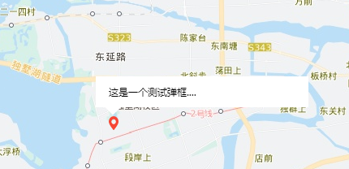

# 百度地图方法扩展


## 地图自定义弹框

### 效果



### 使用方法


```js
let point = new BMap.Point(120.74037,31.27045)

let myCompOverlay = new MapOverLay({
  point: point,
  template: `
    <div class='one'>
      这是一个测试弹框....
    </div>
  `,
  closeFun: ()=>{
    console.log('点击关闭了...');
  }
});
map.addOverlay(myCompOverlay);

```
### 样式

```css
/* 可自行修改 */
.map_info_tip{
  background-color: #FFFFFF;
  border: 1px solid #FFFFFF;
  height: auto;
  max-width: 300px;
  white-space: nowrap;
  user-select: none;
  font-size: 12px;
  padding: 10px 15px;
  cursor: pointer;
  min-width: 230px;
}

```
### option

| name       | type              |  default     | required |
| --------   | : -----           | :---         | : -----  |
| divClass   | string            | map_info_tip | n        |
| x          | number            |   18         | n        |
| y          | number            |   27         | n        |
| point      | new BMap.Point()  |              | y        |
| template   | string            |  ' '         | n        |
| isShowClose| boolean           |   false      | n        |
| closeFun   | function          |   null       | n        |
